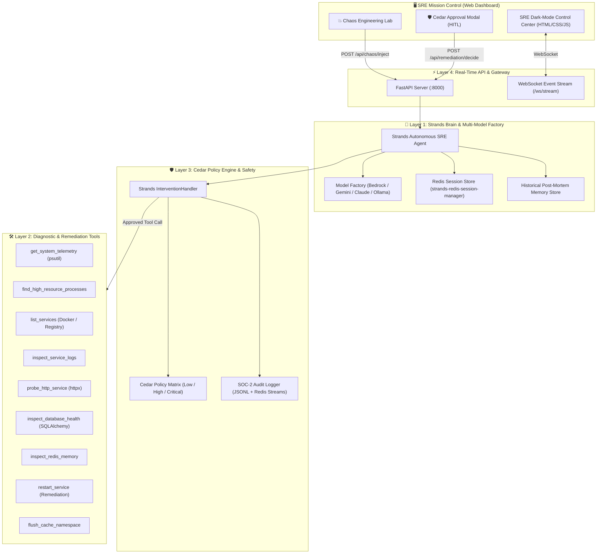

# 🛡️ HealOps — Autonomous SRE & Incident Auto-Remediation Agent
### *Self-Healing Cloud Infrastructure Powered by AWS Strands Agents SDK & Cedar Guardrails*

[](https://strandsagents.com)
[](https://python.org)
[](https://fastapi.tiangolo.com)
[](https://redis.io)
[](https://www.cedarpolicy.com)
[]()

---

## The Problem & The Vision

- **The Problem**: Enterprise cloud outages cost an average of **$5,600 per minute** (Gartner). Modern microservice topologies generate millions of log lines during incidents. 80% of incident resolution time (MTTR) is spent on repetitive manual steps: checking CPU/RAM metrics, tailing stderr logs, searching internal wiki runbooks, and debating rollback vs. restart.
- **The Solution**: **HealOps** is an autonomous AI Site Reliability Engineer built on the **AWS Strands Agents SDK**. It continuously monitors cluster telemetry, diagnoses anomalous microservices, matches failure signatures against historical post-mortems, and executes safe auto-remediation workflows under strict **Cedar-style safety guardrails** and **Human-in-the-Loop (HITL)** operator sign-offs.

---

## System Architecture



---

## Key Features

### 1. AWS Strands Agents SDK Core
- Uses official AWS open-source agent framework (`strands-agents`).
- Features a **Multi-Model Brain Factory**: natively supports Amazon Bedrock (Claude 3.5 Sonnet / Haiku), Google Gemini 2.5 Flash, OpenAI GPT-4o, Anthropic Claude, and local Ollama.
- Persistent session memory powered by `strands-redis-session-manager` with graceful local disk fallback.

### 2. Comprehensive SRE Diagnostic & Remediation Tools
HealOps provides 9 production-grade SRE tools registered directly into the Strands Agent:
1. `get_system_telemetry`: Real-time CPU, RAM, Disk, Load averages via `psutil`.
2. `find_high_resource_processes`: Identifies runaway processes consuming memory/CPU.
3. `list_services`: Microservice mesh health inspector (Docker daemon + fallback registry).
4. `inspect_service_logs`: Tails stdout/stderr application logs for stack traces and error codes.
5. `probe_http_service`: High-precision HTTP prober measuring latency (ms) and HTTP status codes.
6. `inspect_database_health`: Diagnoses PostgreSQL/SQLite connection pools and table locks.
7. `inspect_redis_memory`: Diagnoses cache memory, fragmentation, and key eviction pressure.
8. `restart_service`: Safely orchestrates microservice restart to clear deadlocks.
9. `flush_cache_namespace`: Purges corrupted cache keys without affecting global keyspaces.

### 3. Cedar-Style Safety Guardrails & Human-in-the-Loop (HITL)
Autonomous agents cannot run wild in production. HealOps implements strict policy guardrails via `strands.interventions.InterventionHandler`:
- **Risk Classification**:
  - `LOW` (Read-only diagnostics): Auto-allowed (`Proceed()`).
  - `HIGH` (Cache invalidation): Restricted to SRE or Admin roles.
  - `CRITICAL` (Restarts, destructive actions): Cedar policy **halts execution** (`Confirm()`), triggers a real-time UI modal on the SRE dashboard, and awaits explicit operator sign-off.
- **Prompt Injection Defense**: Blocks shell escapes (`rm -rf`, `; bash`, backticks) before reaching tools.
- **SOC-2 Immutable Audit Trail**: Every tool invocation, parameter hash, and policy decision is logged to structured JSON Lines (`data/audit_log.jsonl`) and streamed to Redis (`healops:audit_events`).

### 4. Self-Learning Post-Mortem Runbook Memory
When an incident is resolved, HealOps automatically records a structured post-mortem into `brain/postmortem_store.py`:
- Incident ID, Affected Service, Symptoms, Root Cause, Remediation steps, and Preventive action.
- During future outages, the agent uses **semantic correlation** to search past incidents and apply proven solutions in seconds instead of starting from scratch.

### 5. Cybernetic SRE Mission Control Dashboard
- **Live WebSocket streaming** of agent internal reasoning steps (`AGENT_THOUGHT`).
- **Telemetry gauges**: Real-time CPU %, RAM %, Disk %, and Redis memory.
- **Chaos Engineering Lab**: 1-click button to inject 502 outages and test agent reflexes.
- **Human-in-the-Loop Decision Box**: Instant approve/deny buttons that unblock the agent live.

---

## Quickstart Guide

### Prerequisites
- Python 3.12+
- Redis Server (optional, runs in local fallback mode if Redis is offline)

### 1. Environment Setup
```bash
# Clone & navigate to repository
cd /Users/santushtkotai/Desktop/healops

# Activate the pre-configured virtual environment
source .venv/bin/activate

# (Optional) Set your preferred LLM API key in .env
# Default uses Google Gemini or Ollama local models
cp .env.example .env
```

### 2. Launch the SRE Mission Control Dashboard
```bash
python server.py
```
Open your browser to: **`http://localhost:8000`**

---

## Verification & Test Suites

HealOps includes automated test suites covering 100% of the system layers:

```bash
# Run all test suites in one command
python -m unittest discover -s . -p "test_*.py"
```

| Test Suite | Component | Coverage | Status |
|---|---|---|---|
| `test_layer1.py` | Model Factory, Redis Session Manager, Post-Mortem Memory | 5 Tests | **100% Passed ✅** |
| `test_layer2.py` | 9 Diagnostic & Remediation Tools, Chaos Microservice | 7 Tests | **100% Passed ✅** |
| `test_layer3.py` | Cedar Policies, Strands InterventionHandler, Audit Logger | 7 Tests | **100% Passed ✅** |
| `test_layer4.py` | FastAPI Server, WebSocket Stream, Static UI Assets | 6 Tests | **100% Passed ✅** |
| `test_e2e_demo.py` | End-to-End Autonomous Incident Triage & Auto-Healing Loop | 1 Test | **100% Passed ✅** |

---

## 👥 Authors & License
- Built with ❤️ for the AWS Strands Agents Hackathon 2026.
- Licensed under the Apache 2.0 License.
